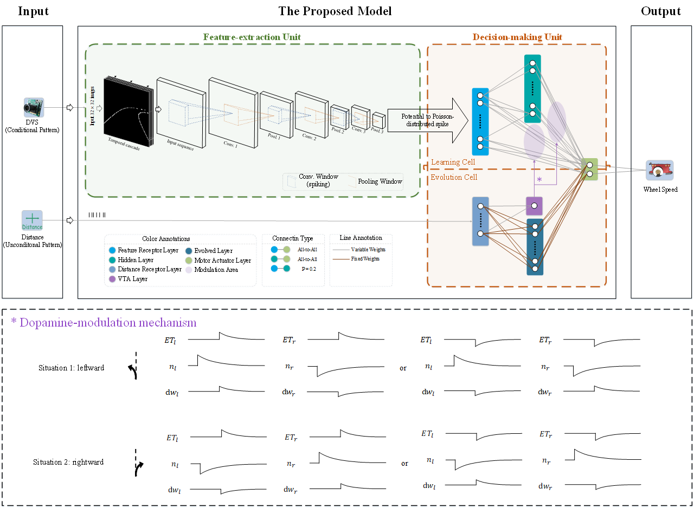
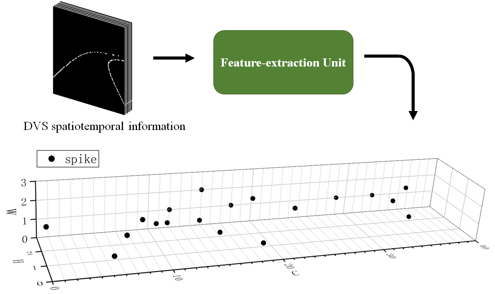
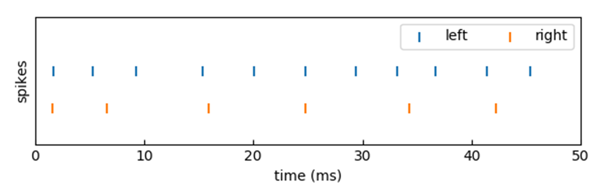
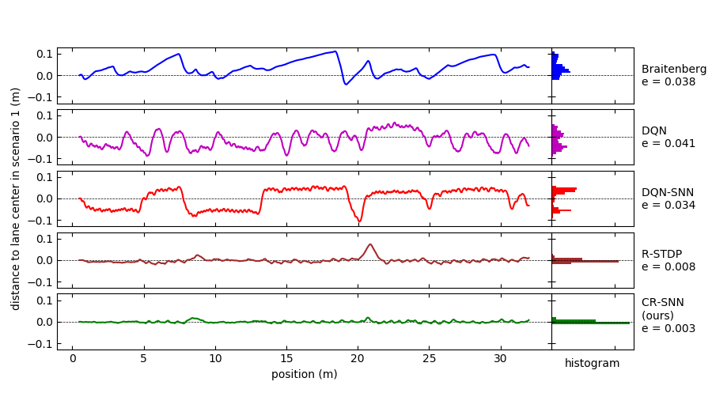
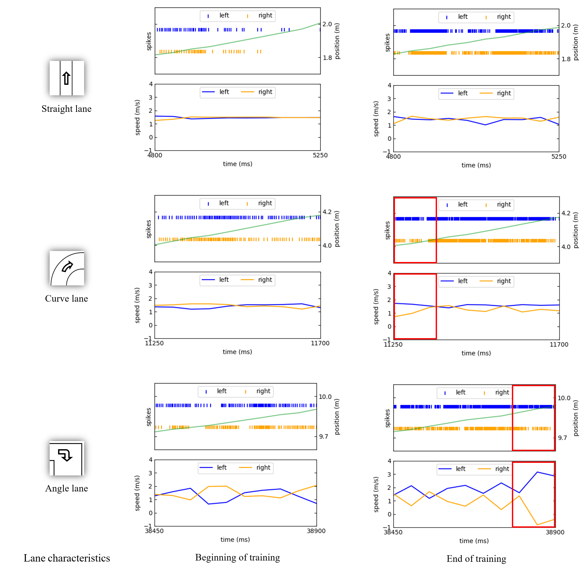
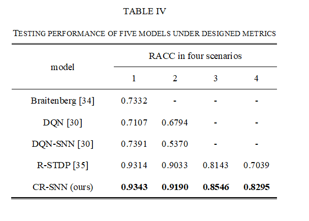
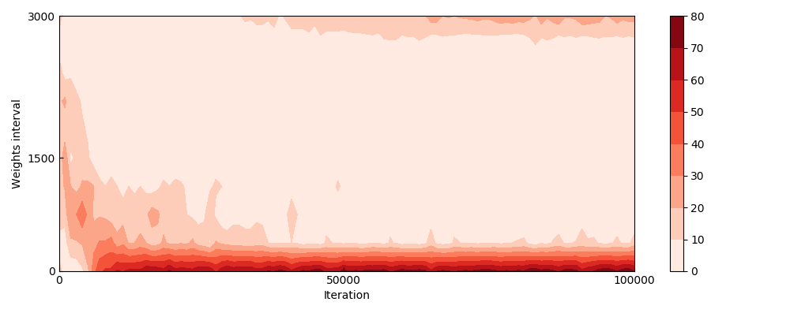

Unsupervised Conditional Reflex Learning Based on Convolutional Spiking Neural Network and Reward Modulation
============
## Model
### Structure

## Requirements
1. [NEST](https://www.nest-simulator.org/)
2. [Pytorch](https://pytorch.org/)
3. [SkypeTorch](https://github.com/miladmozafari/SpykeTorch) 
4. [V-REP (simulation platform)](http://www.coppeliarobotics.com/)
5. [ROS(interface between simulation environment and the script)](https://www.ros.org/)

## Some Results
### A. Visualization of the feature-extraction unit

### B. Visualization of the decision-making unit

### C. Training period

### D. Testing performance

### E. Generalization evaluation

### F. Robustness evaluation
